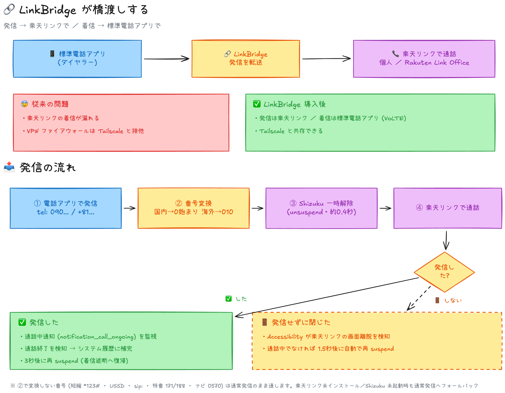
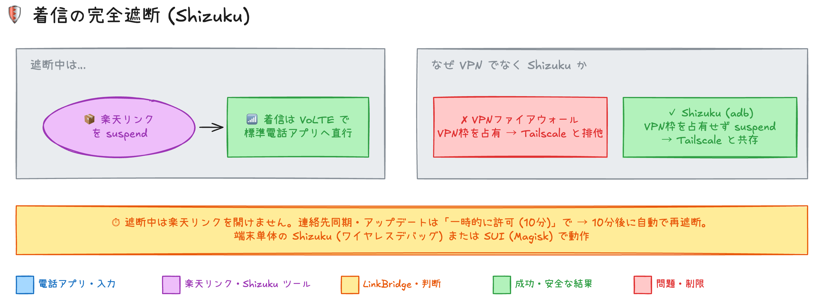

# LinkBridge

ストックダイヤラーからの発信を楽天リンク (`jp.co.rakuten.mobile.rcs` / 法人向け Rakuten Link Office `jp.co.rakuten.mobile.rcs.business`) に転送する個人用 Android アプリ。



## 動作

1. 「デフォルト通話転送アプリ」に設定すると、ダイヤラーからの発信が `CallRedirectionService` に届く
2. 通常の電話番号 (`tel:` スキーム、`*` / `#` を含まない番号) のみ、楽天リンクのダイヤラーを開いて転送。楽天リンクは `+` 付き番号を扱えないため、国内番号は `0` 始まり (`080...` 等)、海外番号は `010` プレフィックス形式 (`01033...` 等) に変換してから渡す
3. それ以外 (ショートコード `*123#` 等・USSD・`sip:` 等・特番 `171`/`188`/`147`/`148`/`1417` 等・ナビダイヤル `0570`・`#7119` 等の短縮番号) は通常発信のまま通す
4. 楽天リンクの「通話中」通知 (`notification_call_ongoing` チャンネル) を監視し、**実際に発信された通話だけ**を通話履歴へ補完する (通知が出ない = 発信していない = 履歴に残らない)

- 緊急通報 (110 / 119 / 118) はフレームワークがリダイレクト対象から除外するため影響しない
- 楽天リンク自身の発信 (自己管理コネクション) はリダイレクト対象外のためループしない

## ビルド

```sh
./gradlew :app:assembleDebug
# APK: app/build/outputs/apk/debug/app-debug.apk
```

## セットアップ

1. APK を端末にインストール
2. アプリを開き「デフォルト通話転送アプリに設定」→ システム画面で LinkBridge を選択
3. 「通話履歴への書き込みを許可」(`WRITE_CALL_LOG`)。一部端末ではダイアログで付与できない場合があり、その場合は adb で付与:

   ```sh
   adb shell pm grant com.hidenobunagai.linkbridge android.permission.WRITE_CALL_LOG
   ```

4. 「画面の上に表示を許可」(`SYSTEM_ALERT_WINDOW`)。通話転送時に楽天リンクをバックグラウンドから起動するために必須 (Android のバックグラウンド起動制限の免除)。adb でも付与可:

   ```sh
   adb shell appops set com.hidenobunagai.linkbridge SYSTEM_ALERT_WINDOW allow
   ```

5. 「通知へのアクセス」を許可。実際に発信された通話だけを通話履歴に記録するために必須。adb でも付与可:

   ```sh
   adb shell cmd notification allow_listener com.hidenobunagai.linkbridge/.CallNotificationListener
   ```

## テスト

```sh
./gradlew :app:testDebugUnitTest
```

## 注意事項

- ビデオ通話は区別できず、音声通話として楽天リンクへ渡る (`onPlaceCall` の 3 引数 API にビデオ情報がないため)
- 通知監視は「転送してから 10 分以内に始まった通話」を転送由来とみなす。転送直後に楽天リンクへの着信があった場合は誤って記録する可能性がある (稀)
- 通知へのアクセスが未許可の間は、楽天リンク発信の履歴補完は行われない
- 通話時間は「通話中通知の開始〜終了」の経過時間 (着信音の時間を含む)

## 任意: 着信の完全遮断 (Shizuku) — Tailscale と共存可

Galaxy のディープスリープや One UI の「バックグラウンドデータ制限」だけでは FCM高優先度で楽天リンクが起床し、バイブのみ鳴って取れない等の漏れが発生します。AdGuard 等の VPNファイアウォールは Tailscale と VPN枠が排他で共存できません。

本アプリは **Shizuku (adb / ワイヤレスデバッグ) 経由で楽天リンクを `suspend` する方式**を追加しました。VPNを占有しないため Tailscale 使用中でも着信を標準電話アプリへ完全フォールバックできます。



### 仕組み

- **遮断中**: `cmd package suspend jp.co.rakuten.mobile.rcs` で楽天リンクを停止。着信はキャリア網(VoLTE)で標準電話アプリに届く
- **発信時**: `LinkRedirectionService` が自動で `unsuspend` → 楽天リンク起動 (約0.4秒待機)
- **終話後**: `CallNotificationListener` が通知終了を検知して 3秒後に再 `suspend`
- **発信せずに閉じた場合**: `LinkBridgeAccessibilityService` が楽天リンクの foreground → background 遷移を検知し、通話中でなければ 1.5秒後に再 `suspend` (発信キャンセルで開きっぱなしになるのを防ぐ)

### セットアップ

1. [Shizuku](https://shizuku.rikka.app/download/) をインストール
2. Shizuku を起動 (Android 11+ は「ワイヤレスデバッグ」で端末単体で起動可、再起動後は要再実行)
   - ガイド: Shizuku アプリ内の「ワイヤレスデバッグ経由で開始」手順に従う
3. LinkBridge を開き、一番下の「着信の完全遮断 (Shizuku)」カードで「権限を付与」→ 許可
4. 「遮断を有効にする」を押す → 楽天リンクが停止 (アイコンが薄く表示)
5. (推奨)「閉じたら再遮断 (Accessibility)」カード →「ユーザー補助設定を開く」→ LinkBridge を ON。発信せずに閉じた場合に自動で再遮断される。adb でも付与可:

   ```sh
   adb shell settings put secure enabled_accessibility_services com.hidenobunagai.linkbridge/.LinkBridgeAccessibilityService
   adb shell settings put secure accessibility_enabled 1
   ```

   > 既に有効なユーザー補助サービスがある場合は、`:` (コロン) 区切りで既存リストに追記してください。

- 「一時的に許可 (10分)」で手動で連絡先同期や更新が可能。10分後に自動で再遮断
- 遮断を無効に戻すときは同カードで「遮断を無効にする」

> **注意**: 遮断中は楽天リンクを開いても起動できません。更新やメッセージ確認時は一時的に許可してください。SUI (Magisk) でも動作します。
